# 1. Configuración necesaria de AWS

## Enciendo el laboratorio de AWS


1. Una vez listo vemos la pantalla principal


2. Entramos en instancias 
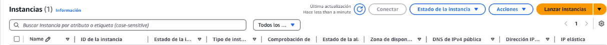

3. Lanzamos una nueva instancia
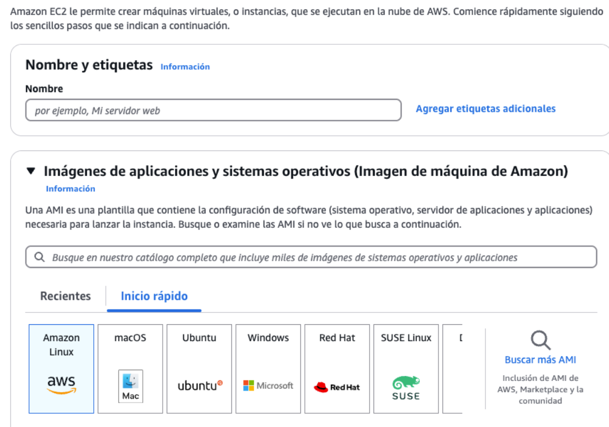
Aplicamos una configuración segun nuestras necesidades, en mi caso la siguiente:
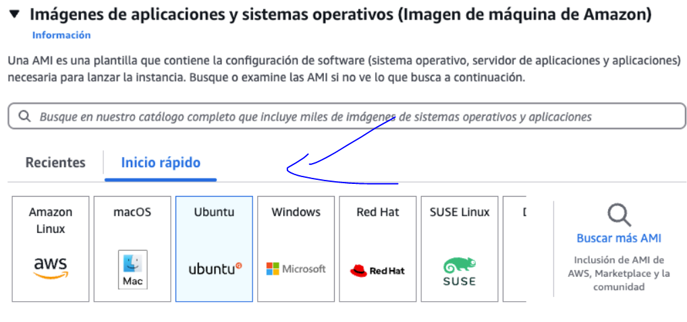
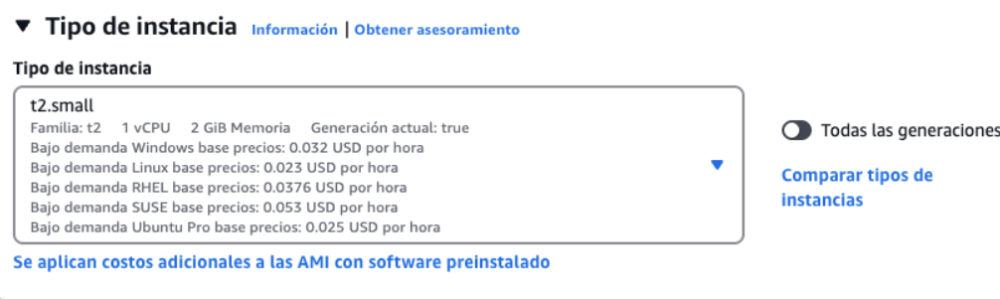


El resultado sería el siguiente:
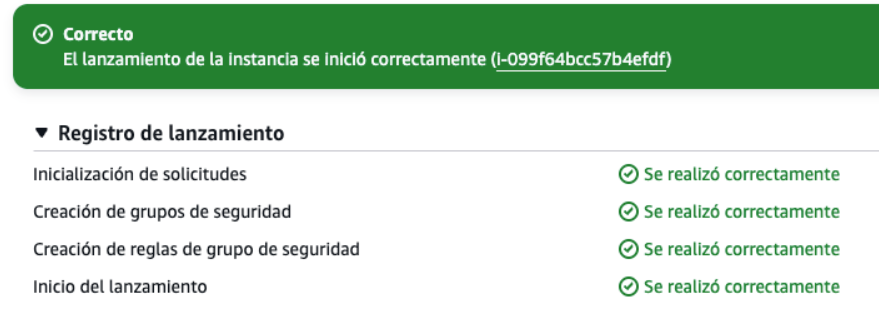

4. Ahora nos conectamos a la instancia desde SSH. Tal que así: 
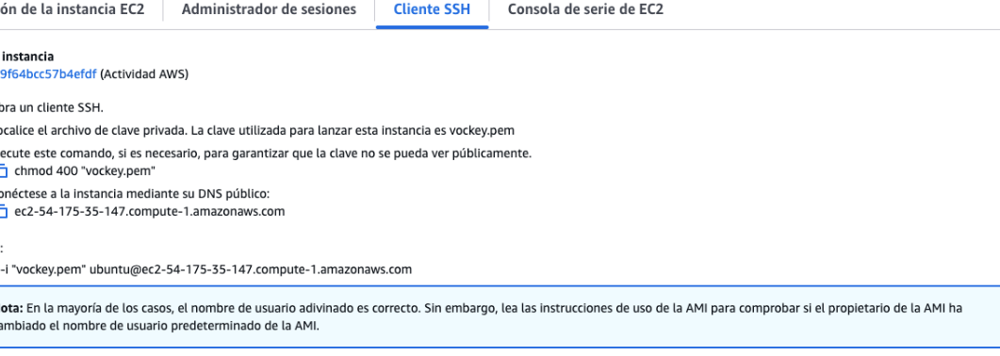
Antes de seguir, es necesario, descargarnos nuestro .pem que se instala. Para ello le damos a "Download Key Pair" y se descargará.

Ahora entramos en el directorio donde esté el .pem y ponemos lo siguiente:
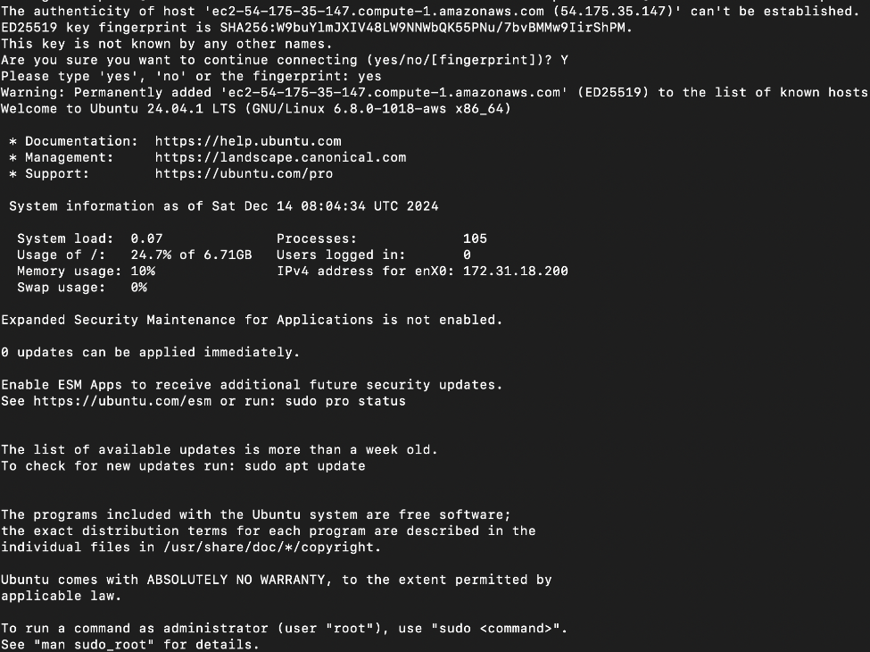
Y ya estamos conectados a la maquina virtual de AWS.

# 2. Activar la autenticación con MySql
1. Primero de todo actualizamos los paquetes con 
```bash
sudo apt update
```

2. Instalamos apache
   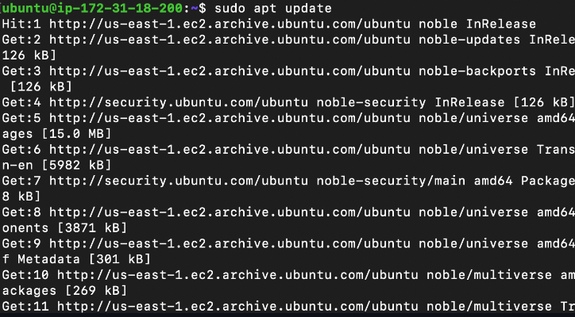

3. Inicia y habilita el servicio Apache:
  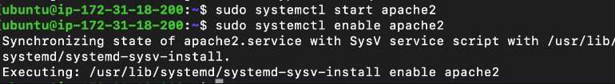

4.  Activar la autenticación con MySQL
    Instala mysql:
    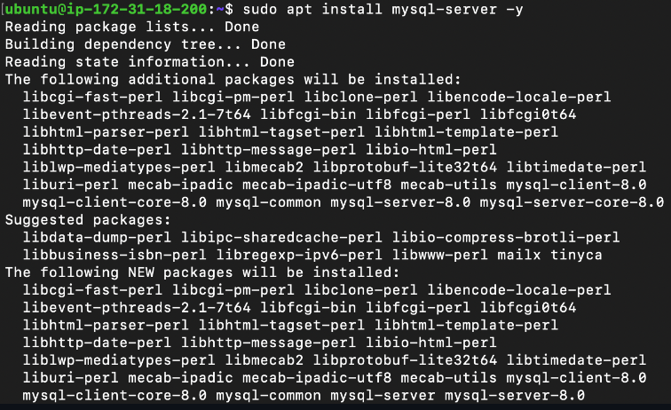

    Ejecutamos el script de seguridad:
   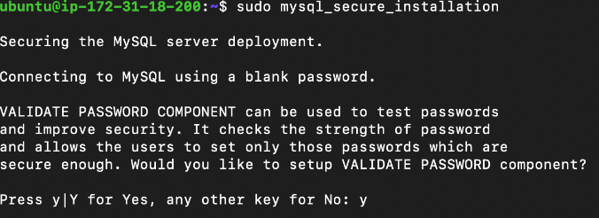
   
5. Crea un usuario y una base de datos para la autenticación:
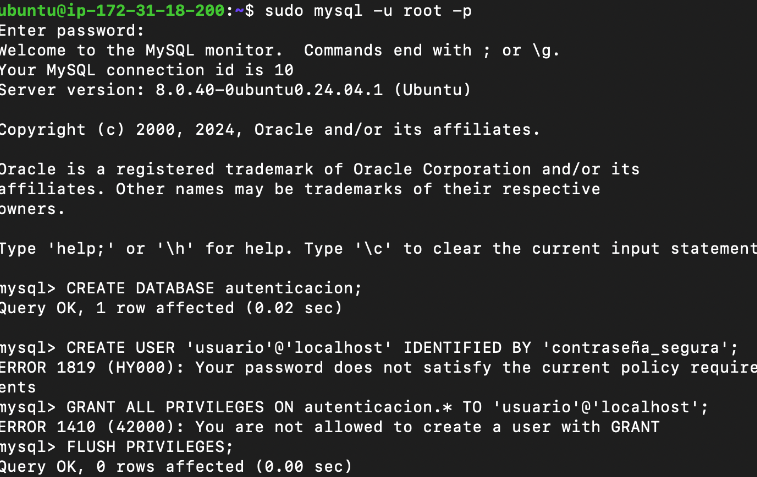

6. Configura la autenticación en Apache:

Instala el módulo de autenticación para MySQL:

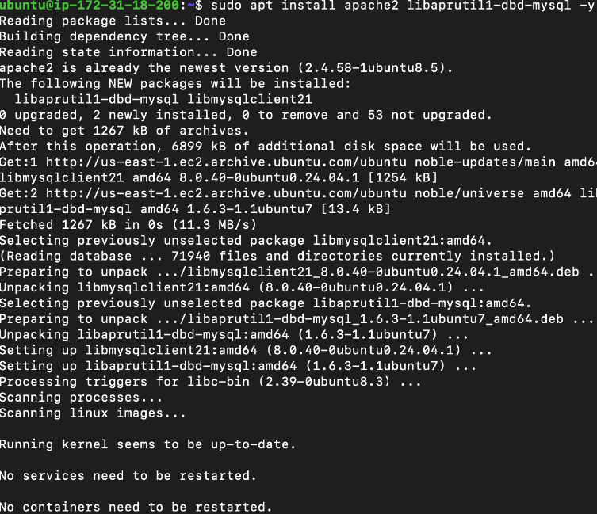

Habilita los módulos de Apache necesarios y reinicia apache:
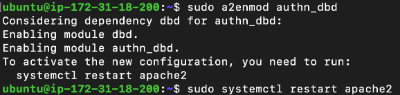

Entra al archivo de configuracion de apache:
```bash
sudo nano /etc/apache2/sites-available/000-default.conf
```
Agrega las siguientes directivas para configurar la autenticación:

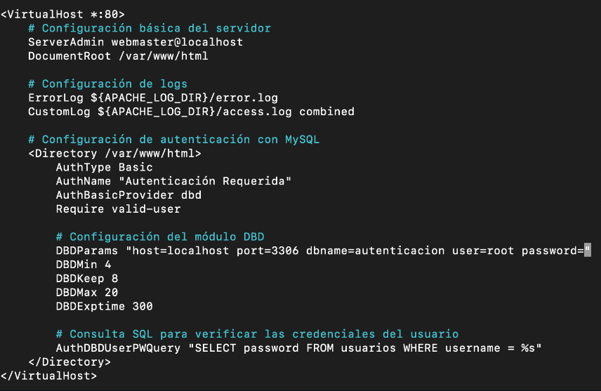

7. Crear la base de datos y la tabla de usuarios
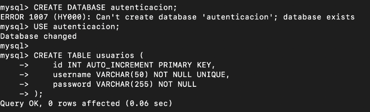

Inserta un usuario. he utilizado bscrypt para encriptar la contraseña
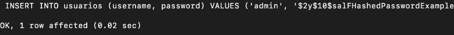

Y reiniciamos Apache.

# Crear un certificado autofirmado y activar el módulo SSL

1.  Instalar OpenSSL y habilitar el módulo SSL

  ```bash
sudo apt install openssl -y

  ```

  ```bash
sudo a2enmod ssl
  ```

2. Generar un certificado autofirmado. <br>
Creamos un directorio para almacenar el certificado y la clave privada y generamos el certificado y la clave privada:


Esto generará dos archivos:
/etc/ssl/certificados/servidor.key (clave privada).
/etc/ssl/certificados/servidor.crt (certificado).

3. Configurar Apache para usar el certificado SSL
Habilitar el archivo de configuración para SSL:
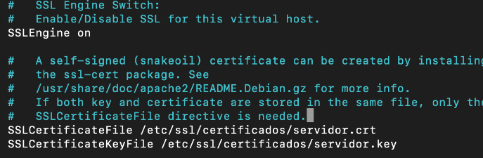

Edita el archivo de configuración del sitio SSL:
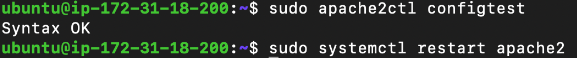
Cerramos apache y es necesarios guardar para terminar.
 


