# 1. Instalación del servidor Apache

Es muy sencillo, deberemos instalarlo con los siguientes comandos:

```bash
#!/bin/bash

sudo apt update
sudo apt install apache2
```
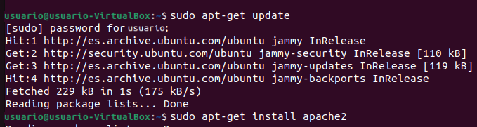

# 2. Configuracion de dominios

Accederemos al archivo /etc/hosts y pondremos lo siguiente:

```bash
127.0.0.1 centro.intranet
127.0.0.1 departamentos.centro.intranet
127.0.0.1 servidor2.centro.intranet
```

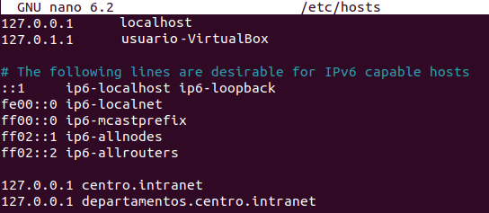

Posteriormente, creamos dos carpetas en /var/www/html con 

```bash
sudo mkdir wordpress
sudo mkdir python-app
```

# 3. Activación de módulos PHP para acceder a MySQL

Acciones que son obligatorias--> Activamos el modulo de PHP8.1 de apache, instalamos MySQL y reiniciamos apache, tal que así:

```bash
sudo a2enmod php8.1
sudo apt install mysql-server
sudo service apache2 restart

```
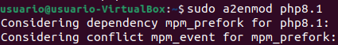


# 3. Instalación de WordPress

Accedemos al directorio donde instalaremos wordpress, descargamos y instalamos la ultima versión, y para terminar modifcamos los permisos con los siguientes comandos

```bash
cd /var/www/html/
sudo wget https://wordpress.org/latest.tar.gz
sudo tar -xzvf latest.tar.gz
sudo chown -R www-data:www-data /var/www/html/wordpress
sudo chmod -R 755 /var/www/html/wordpress

```

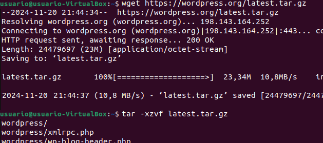

Una vez hecho esto, creamos la base de datos y un usuario mediante MySQL y el comando mysql -u root -p

```bash
mysql -u root -p
```
```sql
CREATE DATABASE wordpress;
CREATE USER 'wordpressuser'@'localhost' IDENTIFIED BY '123';
GRANT ALL PRIVILEGES ON wordpress.* TO 'wordpressuser'@'localhost';
FLUSH PRIVILEGES;
EXIT;
```
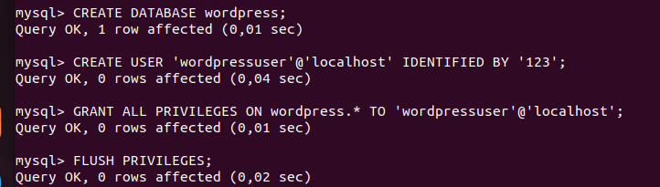

Cuando hayamos creado el usuario y la base de datos, accedemos al archivo de configuración de WordPress y cambiamos lo siguiente:

```php
define('DB_NAME', 'wordpress');
define('DB_USER', 'wordpressuser');
define('DB_PASSWORD', '123');

```

Ahora solo queda mover a la carpeta espécifica de wordpress de /var/www/html y acceder a http://centro.intranet ,para terminar de completar la instalación de WordPress mediante su instalador
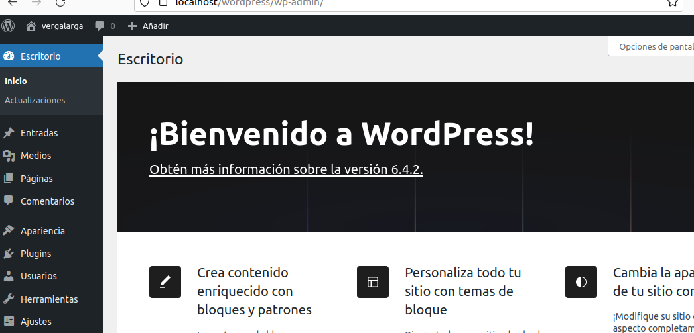
# 4. Creamos la aplicación de python y habilitamos el modulo wsgi
Habilitamos el modulo wsgi

```bash
sudo apt install libapache2-mod-wsgi-py3
sudo a2enmod wsgi
sudo systemctl restart apache2
```
Creamos una aplicación simple y la guardamos en el directorio que queramos, en mi caso se hizo mediante la terminal de visualStudioCode.

```bash
mkdir /var/www/departamentos
echo "def application(environ, start_response):
    status = '200 OK'
    output = b¡'Hola, Mundo!'
    
    response_headers = [('Content-type', 'text/plain')]
    start_response(status, response_headers)
    
    return [output]" | sudo tee /var/www/departamentos/app.py

```


Configuramos /etc/apache2/sites-available/departamentos.centro.intranet.conf tal que asi:

```bash
echo "<VirtualHost *:80>
    ServerAdmin webmaster@localhost
    ServerName departamentos.centro.intranet
    DocumentRoot /var/www/departamentos
    
    <Directory /var/www/departamentos>
        Options Indexes FollowSymLinks
        AllowOverride None
        Require all granted
    </Directory>

    WSGIScriptAlias / /var/www/departamentos/app.py
    WSGIDaemonProcess departamentos user=www-data group=www-data threads=5
    WSGIProcessGroup departamentos

    ErrorLog \${APACHE_LOG_DIR}/error.log
    CustomLog \${APACHE_LOG_DIR}/access.log combined
</VirtualHost>" | sudo tee /etc/apache2/sites-available/departamentos.centro.intranet.conf

```

Habilitamos el sitio y reiniciamos apache 

```bash 
sudo a2ensite departamentos.centro.intranet.conf
sudo systemctl restart apache2

```
Y ahora solo queda acceder a la carpeta por el navegador 
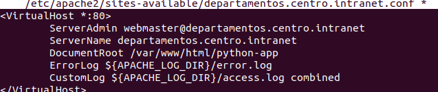

# 5. Protección mediante autenticación

Accedemos al archivo de configuración y ponemos lo siguiente:

```apache 
<Directory /var/www/departamentos.centro.intranet>
    AuthType Basic
    AuthName "Autenticación requerida"
    AuthUserFile /etc/apache2/.htpasswd
    Require valid-user
</Directory>

```
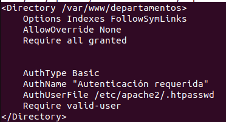

Creamos el archivo .htpasswd

```bash
sudo htpasswd -c /etc/apache2/.htpasswd user
```

Y por ultimo habilitamos el modulo de autentificación

```bash
sudo a2enmod auth_basic
sudo systemctl restart apache2
```
# 6. Instalamos awstats

Instalamos wastats con:
```bash
sudo apt install awstats
sudo cp /etc/awstats/awstats.conf /etc/awstats/awstats.centro.intranet.conf
```


y lo configuramos buscando las lineas de comando:
```ini
LogFormat="%host %other %logname %time1 %methodurl %code %bytesd %refererquot %uaquot %otherquot"
LogFile="/var/log/apache2/access.log"
SiteDomain="centro.intranet"
DirData="/var/lib/awstats"

ShowPagesStats=1
ShowGraphStats=1
ShowCountriesStats=1
Lang="es"
SiteDomain="www-data"

```
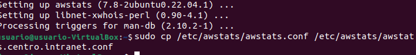

(IMPORTANTE)Guardar y ejecutamos awstats
```bash
sudo awstats -update -config=centro.intranet
```
# 7. Instalamos Nginx

Instalamos el servidor Nginx con:

```bash
sudo apt update
sudo apt install nginx
```

Configuramos el sitio 
```bash
sudo nano /etc/nginx/sites-available/servidor2.centro.intranet
```

con:

```nginx
server {
    listen 8080;
    server_name servidor2.centro.intranet;

    root /var/www/servidor2;
    index index.html index.htm;

    location / {
        try_files $uri $uri/ =404;
    }
}

```
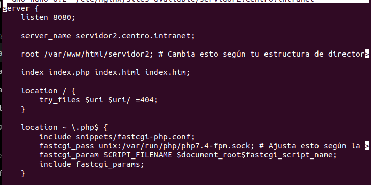
Primero, creamos el directorio, para posteriormente modificar sus servicios y después habilitarlos

```bash
sudo mkdir /var/www/servidor2
sudo chown -R www-data:www-data /var/www/servidor2
sudo chmod -R 755 /var/www/servidor2

sudo ln -s /etc/nginx/sites-available/servidor2.centro.intranet /etc/nginx/sites-enabled/

```

Por ultimo reiniciamos nginx

```bash
sudo systemctl restart nginx
```

Instalamos php y phpMyAdmin

```bash
sudo apt install php8.1-fpm
sudo apt install phpmyadmin
```

Para finalizar, incluimos en el archivo de nginx, lo siguiente:

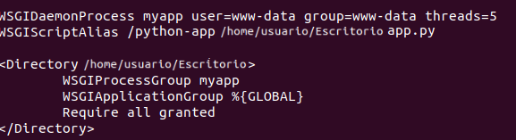
