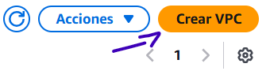
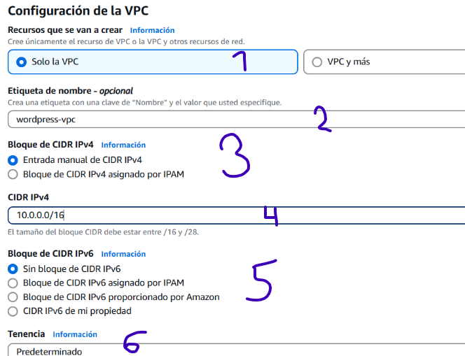
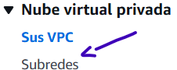
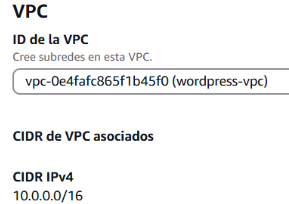
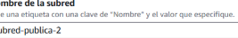

# Configuración de Servidor Web Apache en EC2 con EFS y RDS  

## Introducción  

Este manual tiene como objetivo configurar un servidor web Apache en una instancia EC2 con Debian o Ubuntu. La infraestructura incluirá:  

- **Almacenamiento**: Sistema de archivos en **EFS**.  
- **Base de datos**: Gestionada por **RDS** en una subred privada.  
- **Red**: Un **VPC** con dos subredes públicas y dos privadas.  

## Estructura de la Red  

Para la implementación, configuraremos:  

1. **VPC** con cuatro subredes:  
   - **Dos públicas**: Permitirán la creación de un balanceador de carga para distribuir el tráfico según la carga de los servidores.  
   - **Dos privadas**: Alojarán la base de datos en **RDS** y otros recursos internos.  

2. **Balanceador de Carga**: Mejorará la distribución de tráfico y la disponibilidad del servicio.  

### 1️⃣ Creación de la VPC  

Para comenzar, nos dirigimos a **Servicios → VPC** y creamos una nueva **VPC** con las siguientes configuraciones:  

📌 **Configuración de la VPC**  
- **Nombre del VPC**: `wordpress-vpc` (Ejemplo)  
- **Bloque CIDR IPv4**: `10.0.0.0/16`  
- **Bloque CIDR IPv6**: *No es necesario*  

📸 **Capturas de Pantalla**  
  
  
  
  

---

### 2️⃣ Creación de las Subredes  

#### 🔹 Subredes Públicas  

1. Ir a **VPC → Subredes**  
2. Hacer clic en **Crear subred**  
3. Configurar los siguientes parámetros:  

📌 **Configuración de la Subred Pública**  
- **Nombre de la subred**: `subred-publica-1`  
- **VPC**: `wordpress-vpc`  
- **Zona de disponibilidad (AZ)**: `us-east-1a` (Ejemplo)  
- **Bloque CIDR IPv4**: `10.0.1.0/24`  

📸 **Capturas de Pantalla**  
  
  
 
 
 

#### 🔹 Subredes Privadas  

Para las subredes privadas, seguimos el mismo proceso, pero con los siguientes cambios:  

📌 **Configuración de la Subred Privada**  
- **Nombre de la subred**: `subred-privada-1`  
- **Bloque CIDR IPv4**: `10.0.2.0/24`  

📌 **Nota**: Se repite el proceso para crear una segunda subred pública y otra privada.  
