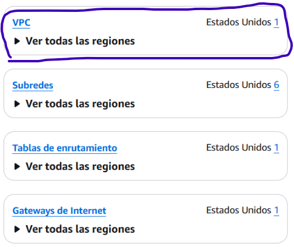
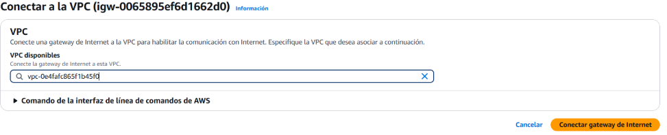
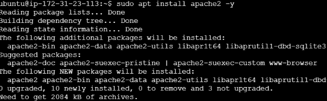

# Configuración de Servidor Web Apache en EC2 con EFS y RDS  

## Introducción  

Este manual tiene como objetivo configurar un servidor web Apache en una instancia EC2 con Debian o Ubuntu. La infraestructura incluirá:  

- **Almacenamiento**: Sistema de archivos en **EFS**.  
- **Base de datos**: Gestionada por **RDS** en una subred privada.  
- **Red**: Un **VPC** con dos subredes públicas y dos privadas.  

## Estructura de la Red  

Para la implementación, configuraremos:  

1. **VPC** con cuatro subredes:  
   - **Dos públicas**: Permitirán la creación de un balanceador de carga para distribuir el tráfico según la carga de los servidores.  
   - **Dos privadas**: Alojarán la base de datos en **RDS** y otros recursos internos.  

2. **Balanceador de Carga**: Mejorará la distribución de tráfico y la disponibilidad del servicio.  

### 1️⃣ Creación de la VPC  

Para comenzar, nos dirigimos a **Servicios → VPC** y creamos una nueva **VPC** con las siguientes configuraciones:  

📌 **Configuración de la VPC**  
- **Nombre del VPC**: `wordpress-vpc` (Ejemplo)  
- **Bloque CIDR IPv4**: `10.0.0.0/16`  
- **Bloque CIDR IPv6**: *No es necesario*  

📸 **Capturas de Pantalla**  
  
  
  
  
 
---

### 2️⃣ Creación de las Subredes  

#### 🔹 Subredes Públicas  

1. Ir a **VPC → Subredes**  
2. Hacer clic en **Crear subred**  
3. Configurar los siguientes parámetros:  

📌 **Configuración de la Subred Pública**  
- **Nombre de la subred**: `subred-publica-1`  
- **VPC**: `wordpress-vpc`  
- **Zona de disponibilidad (AZ)**: `us-east-1a` (Ejemplo)  
- **Bloque CIDR IPv4**: `10.0.1.0/24`  

📸 **Capturas de Pantalla**  
  
  
 
 
 

#### 🔹 Subredes Privadas  

Para las subredes privadas, seguimos el mismo proceso, pero con los siguientes cambios:  

📌 **Configuración de la Subred Privada**  
- **Nombre de la subred**: `subred-privada-1`  
- **Bloque CIDR IPv4**: `10.0.2.0/24`  

📌 **Nota**: Se repite el proceso para crear una segunda subred pública y otra privada.  

### 3.Creación de una puerta de enlace   
**Siguiendo las siguientes imagenes:**

 
 
 
**Una vez creada, selecciona la puerta de enlace y haz clic en el botón Acciones > Adjuntar a VPC , luego selecciona tu VPC ( wordpress-vpc).**

 
 
**Y le damos a conectar, para terminar este proceso.**

### 3.Configuracion de las tablas de ruta  

**Nos dirigimos a Tablas de enrutamiento**
 

**Renombramos la tabla con un nombre de ejemplo como puede ser tabla-rutas-publicas para mantenerla organizada.**
 

**Editamos las rutas y añadimos lo siguiente:**

**Destino:0.0.0.0/0**

**Target (Destino): Selecciona tu Gateway de Internet ( wordpress-gateway).**

 

**Asociamos la tabla a las subredes publicas que creamos anteriormente.**

 
 

**Posteriormenente a realizar estas acciones con las subredes publicas, nos toca repetir el proceso para la tabla y subredes privadas.**
 

**No añadas ninguna ruta adicional (las subredes privadas no necesitan acceso directo a Internet, por lo que no se pone ninguna ruta).**
 

**Unos de los últimos pasos en este proceso es crear la instancia conectando la VPC.**
 

 
###  4.Actualizacion de paquetes.

**Posteriormente, pondremos los siguientes codigos la terminal de AWS para actualizar los paquetes del sistema:**
**sudo apt update**
**sudo apt upgrade -y**

 
###  5.Instalación y inicialización de Apache.

**Instalamos el servidor apache con: sudo apt install apache2 -y**
 

**Iniciamos el servidor apache:sudo systemctl start apache2**

 

**Es obligatorio instalar php: sudo apt install php libapache2-mod-php php-mysql -y**

 

**Posteriormente reiniciamos apache para que la instalación de php se complete con exito.** 

 

**Verificamos la instalacion creando un archivo .php:echo "<?php phpinfo(); ?>" | sudo tee /var/www/html/info.php** 

**Y comprobamos con la siguiente ruta:http://ec2-52-23-171-213.compute-1.amazonaws.com/info.php**

 

**Posteriormente, eliminamos el archivo para una mayor seguridad con:sudo rm /var/www/html/info.php**
 

### 6.Servicio rds.

**Buscamos el servicio rds y accedemos al apartado base de datos siguiendo las siguienetes imagenes**

 
 

**Creamos la base de datos rds.**
**Elige "Creación estándar" para tener más opciones de configuración.**
**En "Opciones del motor", selecciona MySQL como motor de base de datos.**

 

**Configure los siguientes parámetros:**

**Nombre de la base de datos: Elige el nombre que quieras.**
**Nombre de usuario maestro: El que quieras.**
**Contraseña maestra: Establece una contraseña segura la que quieras.**

 

**En "Conectividad", nos aseguramos de que la base de datos esté en la misma VPC que su instancia EC2.**

 

** Configure el grupo de seguridad para permitir el tráfico entrante desde su instancia EC2. **

** Mantén las demás opciones por defecto y haz clic en "Crear base de datos".** 

 

###  7.Servicio EFS.

** Buscamos el servicio EFS  **

 

** Cree un sistema de almacenamiento EFS. ** 

 

** Necesario instalar el paquete nfs-common : sudo apt install nfs-common. ** 

 

** Montar el EFS en la instancia: sudo mount -t nfs4 -o nfsvers=4.1,rsize=1048576,wsize=1048576,hard,timeo=600,retrans=2,noresvport fs-0c78c0d35e7e930af.efs.us-east-1.amazonaws.com:/ /mnt/efs ** 

 

###  5.Acercandonos a tener Wordpress.

** descargamos he instalamos wordpress
cd /var/www/html
sudo wget http://wordpress.org/latest.tar.gz
sudo tar -xzf latest.tar.gz ** 

 

** configuramos la base de datos para worpress: sudo nano wp-config.php
define( 'DB_NAME', 'nombre_de_la_base_de_datos' );
define( 'DB_USER', 'nombre_de_usuario' );
define( 'DB_PASSWORD', 'contraseña_del_usuario' );
define( 'DB_HOST', 'localhost' );
Reemplaza los valores entre comillas con la información correcta de tu base de datos RDS:** 

**DB_NAME: El nombre de tu base de datos en RDS**

**DB_USER: El nombre de usuario de la base de datos**

**DB_PASSWORD: La contraseña de la base de datos**

**DB_HOST: El punto de enlace de tu instancia RDS**

**Nos conectamos a la instancia de la base de datos.**

 

### 8.Creamos la base de datos, el usuario y la contraseña. 

** CREATE DATABASE wordpress; ** 

 

** CREATE USER 'wordpress_user'@'%' IDENTIFIED BY 'password123';  ** 

 

** GRANT ALL PRIVILEGES ON wordpress.* TO 'wordpress_user'@'%';  ** 

 

** FLUSH PRIVILEGES; ** 

 

** Terminando ya, lanzamos la instalación simplemente llamando al servidor web en el navegador:http://44.192.41.132/wordpress ** 

** Con los datos que anteriormente registramos sobre Wordpress rellenamos seguimos el asistente hasta completar la instalación de Wordpress. ** 

 

**Importante. Creamos el archivo wp-config.php y pegamos el codigo que wordpres proporciona.**

 

 
** Tras esto, finalizamos la instalación. **

** Posteriormente de iniciar sesión en Wordpress, confirmamos que la instalación completa ha sido exitosa. **
 
